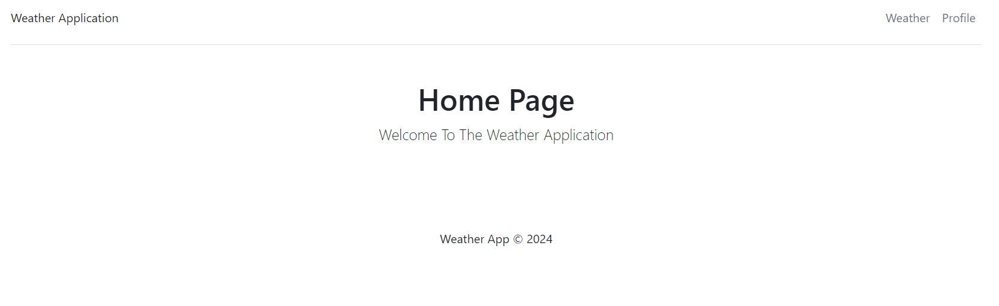
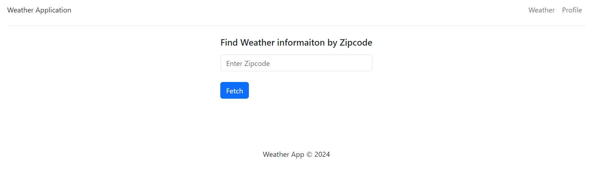
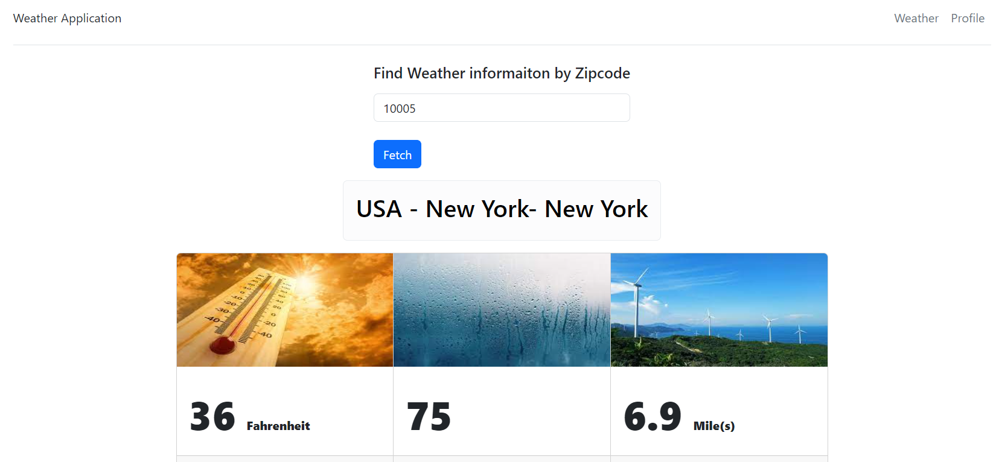

# Welcome to my Weather Service Application!
The purpose of this web application is to show weather data for a given zip code.

The app makes use of an open weather API to get weather data using the following link:
https://www.weatherapi.com/my/

# Initial Step
Clone the repository with the following link:\
https://github.com/mohitps/weather-service-application.git

# Structure
My application is split into two folders, weather-ui (frontend) and weather-api (backend).
In order to use the frontend, the backend must be running. I have created a Dockerfile for the
backend already, and the steps to start the backend are in the next section.

# Prerequisite
This application requires an API key in order to function. The API key can be found at \
https://www.weatherapi.com/my/
1. Create a free account and confirm using your email
2. At the top of the screen should be your API key, click "copy"
3. Go to the "weather-api" and open the "app.py" file
4. Replace "<API_KEY>" on line 24 with your key and hit save

# Start the Backend
The backend has a Dockerfile which can be ran with the following commands:

1. Stop and Build the API Docker Container\
Note: if the container is not yet created then skip to the step 2 command\
```docker stop weatherapi && docker rm weatherapi``` \
Or for linux/powershell users:\
```docker stop weatherapi; docker rm weatherapi```

2. Build the Docker Image - Code is baked into it\
```docker build --tag weatherapi-docker .```

3. Run the Docker container from the Weather API Docker image, exposing port 5000 with the name as weatherapi\
```docker run -d -p 5000:5000 --name weatherapi weatherapi-docker```

4. Command to View logs for the Container\
```docker logs -f weatherapi```


# How to run the UI (Frontend)
1. CD into the weather-ui directory
2. Type ```npm start```, by default it runs on port 3000.\
   For example, if you are running the app on PC, the URL would be http://localhost:3000/

# How to use the application
1. In order to use the UI, first click on the top right link called "Weather"
2. Next, input a ZIP code that you would like to see the weather data for
3. Click fetch, and the data will be displayed on the screen

# Application Screenshots





